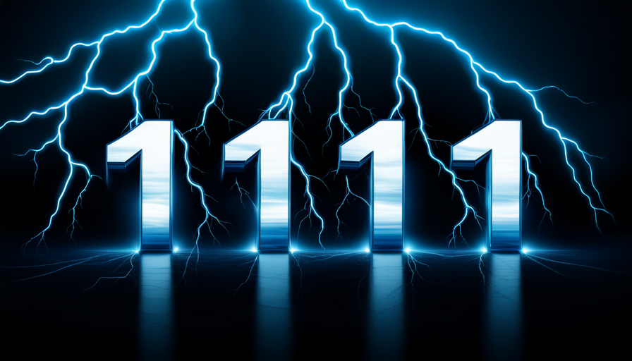

<div align="center">

# 🔌 [`stable-diffusion-webui`](https://github.com/AUTOMATIC1111/stable-diffusion-webui) Plugin

**🗺 Contents – [ℹ️ About](#about) · [⚙️ Usage](#usage) · [⭐️ Features](#features)**

**[⬆️ Top-Level README](../../README.md)**



</div>

# <a id="about" href="#about">ℹ️ About</a>

This plugin enables StableStudio to run using [`stable-diffusion-webui`](https://github.com/AUTOMATIC1111/stable-diffusion-webui), which means you can generate images entirely on your own machine!

Thanks goes to [jtydhr88](https://github.com/jtydhr88) for the original work on this plugin.

# <a id="usage" href="#usage">⚙️ Usage</a>

1. First, you'll need to configure your local installation of `stable-diffusion-webui` to run without the UI and with CORS enabled.

   **Windows**

   Edit the command line arguments within `webui-user.bat`:

   ```
   set COMMANDLINE_ARGS=--nowebui --cors-allow-origins=http://localhost:3000
   ```

   **Mac**

   Edit the command line arguments within `webui-macos-env.sh`:

   ```
   export COMMANDLINE_ARGS="--nowebui --cors-allow-origins=http://localhost:3000"
   ```

2. Start `stable-diffusion-webui` and look for `INFO: Uvicorn running on http://127.0.0.1:7861`.

   You can make sure everything is running correctly by checking to see if [`http://127.0.0.1:7861/docs`](http://127.0.0.1:7861/docs) displays API documentation.

3. Within your installation of StableStudio, run `yarn dev:use-webui-plugin`.

   _**That's it!**_ 🎉 You should now be able to generate images using your local machine.

## <a id="image-history" href="#image-history">💾 Image History</a>

To persist your image history, you'll need to install the [`sd-webui-StableStudio`](https://github.com/jtydhr88/sd-webui-StableStudio) extension for `stable-diffusion-webui`.

# <a id="features" href="#features">⭐️ Features</a>

Missing something? Please [let us know](https://github.com/Stability-AI/StableStudio/issues/new/choose)!

- [x] Text-to-image
- [x] Image-to-image
- [x] Basic features (prompt, negative prompt, steps, batch size, image size)
- [x] Model selection
- [x] Sampler selection
- [x] Masking, in-painting, and out-painting
- [x] Settings storage
- [x] Accurate plugin status
- [x] [Loading existing images]("#image-history)
- [x] Upscaling
- [ ] Lora support
